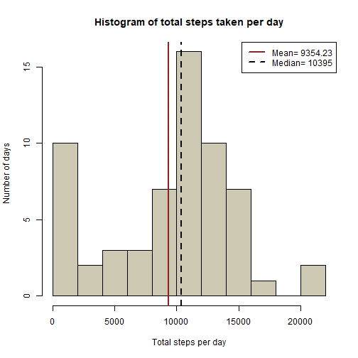
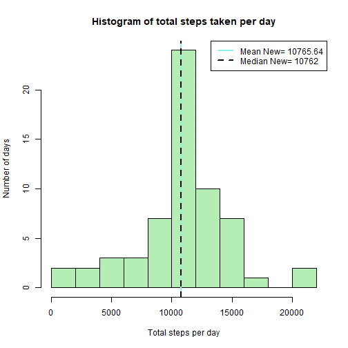
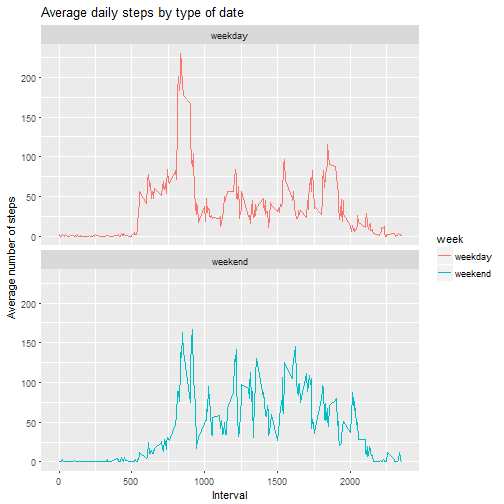

```r
---
title: "Reproducible research Assign1"
author: "D student"
date: "December 5, 2017"
output: html_document
---
```

```
## Error: <text>:8:0: unexpected end of input
## 6: ---
## 7: 
##   ^
```


# Activity Project

This is an R Markdown document for Assignment 1 of Reproducible research Coursera course. 

##Loading and preprocessing the data


```r
activity_data <- read.csv(file="activity.csv", header=TRUE, sep=",")
activity_data$date <- as.Date(activity_data$date)
```

##What is mean total number of steps taken per day?

Calculate the steps per day

```r
library(data.table)
steps <- as.data.table(activity_data)[, list(total_steps = sum(steps, na.rm = T)), by = date ]
```

Plot steps per day(barplot)

```r
hist(steps$total_steps, main = "Histogram of total steps taken per day",
     xlab = "Total steps per day", ylab = "Number of days", 
     breaks = 10, col = "cornsilk3")
abline(v = mean(steps$total_steps), lty = 1, lwd = 2, col = "brown4")
abline(v = median(steps$total_steps), lty = 2, lwd = 2, col = "black")
legend(x = "topright", c(paste("Mean=", round(mean(steps$total_steps),2)) , 
                         paste("Median=", round(median(steps$total_steps),2))),
       col = c("brown4", "black"),lty = c(1, 2), lwd = c(2, 2))
```



What is the average daily activity pattern?


```r
library(ggplot2)
steps_time <- as.data.table(activity_data)[, list(av_steps = sum(steps, na.rm = T)), by = interval ]
g <- ggplot(steps_time, aes(x=interval, y=av_steps))
g <- g + geom_line()
g <- g + ggtitle("Average number of steps per intervals")+ ylab("Average num of steps") + xlab("Interval")
```

The interval of best number of steps is:

```r
steps_time[which.max(steps_time$av_steps), ]$interval
```

```
## [1] 835
```

##Imputing missing values

Calculate and report the total number of missing values in the dataset (i.e. the total number of rows with NAs)

```r
sum(is.na(activity_data$steps))
```

```
## [1] 2304
```

Devise a strategy for filling in all of the missing values in the dataset. 
We fill na values with mean of interval


```r
activity_data_na <- copy(as.data.table(activity_data))
activity_data_na <- activity_data_na[, mean_of_interval:=round(mean(as.numeric(steps), na.rm = T)),
                                     by = interval]
```

Create a new dataset that is equal to the original dataset but with the missing data filled in.

```r
activity_data_na$steps <- ifelse(is.na(activity_data_na$steps),
                                 activity_data_na$mean_of_interval,
                                 activity_data_na$steps)
activity_data <- activity_data_na
```

Make a histogram of the total number of steps taken each day and Calculate and report the mean and median total number of steps taken per day. Do these values differ from the estimates from the first part of the assignment? What is the impact of imputing missing data on the estimates of the total daily number of steps?

```r
steps2 <- as.data.table(activity_data)[, list(total_steps = sum(steps)), by = date ]
hist(steps2$total_steps, main = "Histogram of total steps taken per day",
     xlab = "Total steps per day", ylab = "Number of days", 
     breaks = 10, col = "darkseagreen2")
abline(v = mean(steps2$total_steps), lty = 1, lwd = 2, col = "darkslategray2")
abline(v = median(steps2$total_steps), lty = 2, lwd = 2, col = "black")
legend(x = "topright", c(paste("Mean New=", round(mean(steps2$total_steps),2)) , 
                         paste("Median New=", round(median(steps2$total_steps),2))), 
       col = c("darkslategray2", "black"),lty = c(1, 2), lwd = c(2, 2))
```



##Are there differences in activity patterns between weekdays and weekends?
Create a new factor variable in the dataset with two levels - "weekday" and "weekend" indicating whether a given date is a weekday or weekend day.


```r
library(chron)
activity_data$week = is.weekend(activity_data$date)
activity_data$week[activity_data$week == "TRUE"] <- "weekend"
activity_data$week[activity_data$week == "FALSE"] <- "weekday"
```

Make a panel plot containing a time series plot (i.e. type = "l") of the 5-minute interval (x-axis) and the average number of steps taken, averaged across all weekday days or weekend days (y-axis). See the README file in the GitHub repository to see an example of what this plot should look like using simulated data.


```r
activity_week <- activity_data[, list(av_steps = mean(steps)), by = list(interval, week)]
g <- ggplot(activity_week, aes(x=interval, y=av_steps, color = week))
g <- g + geom_line()
g <- g + facet_wrap(~week, ncol = 1, nrow=2) 
g <- g + labs(title = "Average daily steps by type of date", x = "Interval", y = "Average number of steps")
g
```


```

